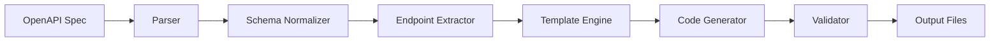

# Terraform Provider Umbrella - Developer Guide

## Table of Contents

1. [Development Environment Setup](#development-environment-setup)
2. [Code Structure and Organization](#code-structure-and-organization)
3. [Adding New Features](#adding-new-features)
4. [Testing and Validation](#testing-and-validation)
5. [Code Generation System](#code-generation-system)
6. [Contributing Guidelines](#contributing-guidelines)
7. [Release Management](#release-management)
8. [Debugging and Troubleshooting](#debugging-and-troubleshooting)
9. [Performance Optimization](#performance-optimization)
10. [Security Considerations](#security-considerations)

## Development Environment Setup

### Prerequisites

#### Required Software
- **Go**: Version 1.21 or later
- **Git**: Version 2.30 or later
- **Make**: GNU Make 4.0 or later
- **Docker**: Version 20.10 or later (optional, for containerized development)

#### Development Tools
```bash
# Install Go tools
go install golang.org/x/tools/cmd/goimports@latest
go install github.com/golangci/golangci-lint/cmd/golangci-lint@latest
go install github.com/securecodewarrior/gosec/v2/cmd/gosec@latest

# Install Terraform
curl -fsSL https://apt.releases.hashicorp.com/gpg | sudo apt-key add -
sudo apt-add-repository "deb [arch=amd64] https://apt.releases.hashicorp.com $(lsb_release -cs) main"
sudo apt-get update && sudo apt-get install terraform
```

### Repository Setup

#### 1. Clone and Initialize

```bash
# Clone the repository
git clone https://github.com/mantisec/terraform-provider-umbrella.git
cd terraform-provider-umbrella

# Install dependencies
go mod download

# Verify setup
make help
```

#### 2. Development Configuration

Create development configuration files:

```bash
# Copy configuration templates
cp tools/generator/config/generation.yaml.example tools/generator/config/generation.yaml
cp tools/generator/config/advanced_config.yaml.example tools/generator/config/advanced_config.yaml

# Set up environment variables
cat > .env.development << EOF
UMBRELLA_API_KEY=your-dev-api-key
UMBRELLA_API_SECRET=your-dev-api-secret
UMBRELLA_ORG_ID=your-dev-org-id
TF_LOG=DEBUG
TF_LOG_PATH=terraform-debug.log
EOF
```

#### 3. IDE Configuration

**VS Code Settings** (`.vscode/settings.json`):
```json
{
    "go.useLanguageServer": true,
    "go.lintTool": "golangci-lint",
    "go.lintFlags": ["--fast"],
    "go.testFlags": ["-v"],
    "go.testTimeout": "30m",
    "files.exclude": {
        "**/.git": true,
        "**/node_modules": true,
        "**/.terraform": true,
        "**/.terraform.lock.hcl": true
    }
}
```

**GoLand Configuration**:
- Enable Go modules support
- Configure golangci-lint as external tool
- Set up run configurations for tests and builds

### Build and Test

#### Initial Build
```bash
# Build the provider
make build

# Run tests
make test

# Run linting
make lint

# Generate code
make generate
```

#### Verify Installation
```bash
# Install locally for testing
make install-local

# Test with example configuration
cd examples/basic
terraform init
terraform plan
```

## Code Structure and Organization

### Project Layout

```
terraform-provider-umbrella/
├── cmd/                          # Command-line interfaces
├── internal/                     # Internal packages
│   └── provider/                 # Provider implementation
│       ├── client.go            # Base API client
│       ├── provider.go          # Provider configuration
│       ├── resource_*.go        # Manual resources
│       ├── data_source_*.go     # Manual data sources
│       ├── generated_*.go       # Generated code
│       └── tests/               # Test files
├── tools/                       # Development tools
│   └── generator/               # Code generation system
│       ├── cmd/                 # Generator CLI
│       ├── config/              # Configuration management
│       ├── parser/              # OpenAPI parsing
│       ├── generator/           # Code generators
│       ├── templates/           # Code templates
│       ├── validator/           # Validation framework
│       └── performance/         # Performance optimization
├── docs/                        # Documentation
├── examples/                    # Usage examples
├── scripts/                     # Build and release scripts
├── .github/                     # GitHub workflows
├── go.mod                       # Go module definition
├── Makefile                     # Build automation
└── README.md                    # Project overview
```

### Package Organization

#### Core Provider (`internal/provider/`)

**Provider Core**:
- [`provider.go`](internal/provider/provider.go:1) - Provider configuration and registration
- [`client.go`](internal/provider/client.go:1) - Base API client with OAuth2 authentication
- [`utils.go`](internal/provider/utils.go:1) - Common utilities and helpers

**Manual Resources**:
- `resource_*.go` - Manually implemented resources
- `data_source_*.go` - Manually implemented data sources

**Generated Code**:
- [`generated_client.go`](internal/provider/generated_client.go:1) - Enhanced API client
- [`generated_registry.go`](internal/provider/generated_registry.go:1) - Resource registration
- `generated_*_resource.go` - Generated resource implementations
- `generated_*_methods.go` - Generated client methods

#### Code Generation System (`tools/generator/`)

**Parser Package** ([`parser/`](tools/generator/parser/)):
- [`models.go`](tools/generator/parser/models.go:1) - Data structure definitions
- [`openapi_parser.go`](tools/generator/parser/openapi_parser.go:1) - OpenAPI specification parsing
- [`schema_normalizer.go`](tools/generator/parser/schema_normalizer.go:1) - Schema transformation
- [`endpoint_extractor.go`](tools/generator/parser/endpoint_extractor.go:1) - Endpoint classification

**Generator Package** ([`generator/`](tools/generator/generator/)):
- [`template_engine.go`](tools/generator/generator/template_engine.go:1) - Template rendering engine
- [`resource_generator.go`](tools/generator/generator/resource_generator.go:1) - Resource code generation
- [`data_source_generator.go`](tools/generator/generator/data_source_generator.go:1) - Data source generation
- [`client_method_generator.go`](tools/generator/generator/client_method_generator.go:1) - Client method generation

### Coding Standards

#### Go Style Guidelines

Follow the official Go style guide with these additions:

```go
// Package documentation
// Package provider implements the Terraform provider for Cisco Umbrella.
// It provides resources and data sources for managing Umbrella configurations
// through the REST API.
package provider

// Function documentation
// NewDestinationListResource creates a new destination list resource instance.
// It initializes the resource with the necessary client and configuration.
func NewDestinationListResource() resource.Resource {
    return &DestinationListResource{}
}

// Struct documentation
// DestinationListResource implements the Terraform resource interface
// for managing Umbrella destination lists.
type DestinationListResource struct {
    client *apiClient
}
```

#### Error Handling Patterns

```go
// Standard error handling
func (r *Resource) Create(ctx context.Context, req resource.CreateRequest, resp *resource.CreateResponse) {
    var data ResourceModel
    
    // Get configuration
    diags := req.Config.Get(ctx, &data)
    resp.Diagnostics.Append(diags...)
    if resp.Diagnostics.HasError() {
        return
    }
    
    // API call with error handling
    result, err := r.client.CreateResource(ctx, data)
    if err != nil {
        resp.Diagnostics.AddError(
            "Error creating resource",
            fmt.Sprintf("Could not create resource: %s", err),
        )
        return
    }
    
    // Update state
    data.ID = types.StringValue(result.ID)
    diags = resp.State.Set(ctx, &data)
    resp.Diagnostics.Append(diags...)
}
```

#### Logging Standards

```go
import (
    "github.com/hashicorp/terraform-plugin-log/tflog"
)

func (r *Resource) performOperation(ctx context.Context) error {
    // Structured logging with context
    tflog.Debug(ctx, "Starting operation", map[string]interface{}{
        "resource_type": "destination_list",
        "operation":     "create",
    })
    
    // Log important events
    tflog.Info(ctx, "Resource created successfully", map[string]interface{}{
        "resource_id": resourceID,
    })
    
    return nil
}
```

## Adding New Features

### Adding Manual Resources

#### 1. Create Resource Structure

```go
// internal/provider/resource_new_feature.go
package provider

import (
    "context"
    "fmt"
    
    "github.com/hashicorp/terraform-plugin-framework/resource"
    "github.com/hashicorp/terraform-plugin-framework/resource/schema"
    "github.com/hashicorp/terraform-plugin-framework/types"
)

type NewFeatureResource struct {
    client *apiClient
}

func NewNewFeatureResource() resource.Resource {
    return &NewFeatureResource{}
}

func (r *NewFeatureResource) Metadata(_ context.Context, req resource.MetadataRequest, resp *resource.MetadataResponse) {
    resp.TypeName = req.ProviderTypeName + "_new_feature"
}

func (r *NewFeatureResource) Schema(_ context.Context, _ resource.SchemaRequest, resp *resource.SchemaResponse) {
    resp.Schema = schema.Schema{
        Description: "Manages a new feature resource.",
        Attributes: map[string]schema.Attribute{
            "id": schema.StringAttribute{
                Description: "Unique identifier for the resource.",
                Computed:    true,
            },
            "name": schema.StringAttribute{
                Description: "Name of the resource.",
                Required:    true,
            },
        },
    }
}
```

#### 2. Implement CRUD Operations

```go
func (r *NewFeatureResource) Create(ctx context.Context, req resource.CreateRequest, resp *resource.CreateResponse) {
    var data NewFeatureResourceModel
    
    diags := req.Config.Get(ctx, &data)
    resp.Diagnostics.Append(diags...)
    if resp.Diagnostics.HasError() {
        return
    }
    
    // API call
    result, err := r.client.createNewFeature(ctx, data)
    if err != nil {
        resp.Diagnostics.AddError("Error creating resource", err.Error())
        return
    }
    
    // Update state
    data.ID = types.StringValue(result.ID)
    diags = resp.State.Set(ctx, &data)
    resp.Diagnostics.Append(diags...)
}

// Implement Read, Update, Delete methods similarly
```

#### 3. Register Resource

```go
// internal/provider/provider.go
func (p *umbrellaProvider) Resources(_ context.Context) []func() resource.Resource {
    resources := []func() resource.Resource{
        // Existing resources...
        NewNewFeatureResource, // Add new resource
    }
    return resources
}
```

### Adding Generated Resources

#### 1. Create OpenAPI Specification

```yaml
# new_feature_api.yaml
openapi: 3.0.0
info:
  title: New Feature API
  version: 1.0.0
paths:
  /new-features:
    post:
      operationId: createNewFeature
      requestBody:
        content:
          application/json:
            schema:
              $ref: '#/components/schemas/NewFeature'
      responses:
        '201':
          description: Created
          content:
            application/json:
              schema:
                $ref: '#/components/schemas/NewFeature'
    get:
      operationId: listNewFeatures
      responses:
        '200':
          description: Success
          content:
            application/json:
              schema:
                type: array
                items:
                  $ref: '#/components/schemas/NewFeature'
  
  /new-features/{id}:
    get:
      operationId: getNewFeature
      parameters:
        - name: id
          in: path
          required: true
          schema:
            type: string
      responses:
        '200':
          description: Success
          content:
            application/json:
              schema:
                $ref: '#/components/schemas/NewFeature'

components:
  schemas:
    NewFeature:
      type: object
      required:
        - name
      properties:
        id:
          type: string
          readOnly: true
        name:
          type: string
          description: Name of the new feature
        description:
          type: string
          description: Description of the new feature
```

#### 2. Configure Generation

```yaml
# tools/generator/config/advanced_config.yaml
schema_overrides:
  resources:
    new_feature:
      schema_transforms:
        - field: "name"
          type: "string"
          validation: "min_length=1,max_length=100"
      
      validation_rules:
        - rule: "name_not_empty"
          message: "Name cannot be empty"
```

#### 3. Generate Code

```bash
# Generate the new resource
go run tools/generator/cmd/generate/main.go -specs new_feature_api.yaml

# Verify generated files
ls -la internal/provider/generated_new_feature_*
```

### Adding Custom Generators

#### 1. Create Generator Interface

```go
// tools/generator/generator/custom_generator.go
package generator

type CustomGenerator interface {
    Name() string
    Generate(spec *parser.APISpec, config *config.Config) (*GeneratedFile, error)
    Validate(file *GeneratedFile) []ValidationError
}
```

#### 2. Implement Custom Generator

```go
type MetricsGenerator struct {
    config *config.Config
    engine *TemplateEngine
}

func NewMetricsGenerator(config *config.Config) *MetricsGenerator {
    return &MetricsGenerator{
        config: config,
        engine: NewTemplateEngine(),
    }
}

func (g *MetricsGenerator) Name() string {
    return "metrics"
}

func (g *MetricsGenerator) Generate(spec *parser.APISpec, config *config.Config) (*GeneratedFile, error) {
    // Generate metrics collection code
    data := struct {
        Resources []string
        Package   string
    }{
        Resources: extractResourceNames(spec),
        Package:   config.Global.PackageName,
    }
    
    content, err := g.engine.RenderTemplate("metrics.go.tmpl", data)
    if err != nil {
        return nil, err
    }
    
    return &GeneratedFile{
        Path:    "internal/provider/generated_metrics.go",
        Content: content,
    }, nil
}
```

#### 3. Register Custom Generator

```go
// tools/generator/cmd/generate/main.go
func main() {
    // ... existing code ...
    
    // Register custom generators
    gen.RegisterCustomGenerator(NewMetricsGenerator(cfg))
    
    // ... rest of main function ...
}
```

## Testing and Validation

### Test Structure

#### Unit Tests
```go
// internal/provider/resource_test.go
package provider

import (
    "testing"
    
    "github.com/hashicorp/terraform-plugin-framework/resource"
    "github.com/hashicorp/terraform-plugin-testing/helper/resource"
)

func TestDestinationListResource_Schema(t *testing.T) {
    r := NewDestinationListResource()
    
    // Test schema validation
    req := resource.SchemaRequest{}
    resp := &resource.SchemaResponse{}
    
    r.Schema(context.Background(), req, resp)
    
    if resp.Diagnostics.HasError() {
        t.Fatalf("Schema validation failed: %v", resp.Diagnostics)
    }
    
    // Verify required attributes
    if _, ok := resp.Schema.Attributes["name"]; !ok {
        t.Error("Expected 'name' attribute in schema")
    }
}
```

#### Integration Tests
```go
func TestDestinationListResource_CRUD(t *testing.T) {
    resource.Test(t, resource.TestCase{
        ProtoV6ProviderFactories: testAccProtoV6ProviderFactories,
        Steps: []resource.TestStep{
            // Create
            {
                Config: testAccDestinationListResourceConfig("test-list"),
                Check: resource.ComposeAggregateTestCheckFunc(
                    resource.TestCheckResourceAttr("umbrella_destination_list.test", "name", "test-list"),
                    resource.TestCheckResourceAttrSet("umbrella_destination_list.test", "id"),
                ),
            },
            // Update
            {
                Config: testAccDestinationListResourceConfig("updated-list"),
                Check: resource.ComposeAggregateTestCheckFunc(
                    resource.TestCheckResourceAttr("umbrella_destination_list.test", "name", "updated-list"),
                ),
            },
            // Import
            {
                ResourceName:      "umbrella_destination_list.test",
                ImportState:       true,
                ImportStateVerify: true,
            },
        },
    })
}
```

#### Acceptance Tests
```go
func TestAccDestinationListResource_complete(t *testing.T) {
    if os.Getenv("TF_ACC") == "" {
        t.Skip("Acceptance tests skipped unless env 'TF_ACC' set")
    }
    
    resource.Test(t, resource.TestCase{
        ProtoV6ProviderFactories: testAccProtoV6ProviderFactories,
        Steps: []resource.TestStep{
            {
                Config: testAccDestinationListResourceConfigComplete(),
                Check: resource.ComposeAggregateTestCheckFunc(
                    testAccCheckDestinationListExists("umbrella_destination_list.test"),
                    resource.TestCheckResourceAttr("umbrella_destination_list.test", "destinations.#", "3"),
                ),
            },
        },
    })
}
```

### Test Utilities

#### Mock Client
```go
// internal/provider/testing.go
type MockClient struct {
    responses map[string]interface{}
    errors    map[string]error
}

func NewMockClient() *MockClient {
    return &MockClient{
        responses: make(map[string]interface{}),
        errors:    make(map[string]error),
    }
}

func (m *MockClient) SetResponse(endpoint string, response interface{}) {
    m.responses[endpoint] = response
}

func (m *MockClient) SetError(endpoint string, err error) {
    m.errors[endpoint] = err
}

func (m *MockClient) do(ctx context.Context, method, path string, body []byte) (*http.Response, error) {
    key := fmt.Sprintf("%s:%s", method, path)
    
    if err, exists := m.errors[key]; exists {
        return nil, err
    }
    
    if response, exists := m.responses[key]; exists {
        // Create mock HTTP response
        return createMockResponse(response), nil
    }
    
    return nil, fmt.Errorf("no mock response configured for %s", key)
}
```

#### Test Helpers
```go
func testAccCheckDestinationListExists(resourceName string) resource.TestCheckFunc {
    return func(s *terraform.State) error {
        rs, ok := s.RootModule().Resources[resourceName]
        if !ok {
            return fmt.Errorf("resource not found: %s", resourceName)
        }
        
        if rs.Primary.ID == "" {
            return fmt.Errorf("resource ID not set")
        }
        
        // Verify resource exists via API
        client := testAccProvider.Meta().(*apiClient)
        _, err := client.getDestinationList(context.Background(), rs.Primary.ID)
        return err
    }
}
```

### Running Tests

#### Local Testing
```bash
# Run unit tests
go test ./internal/provider/... -v

# Run with coverage
go test ./internal/provider/... -coverprofile=coverage.out
go tool cover -html=coverage.out

# Run specific test
go test ./internal/provider/... -run TestDestinationListResource -v

# Run acceptance tests (requires API credentials)
TF_ACC=1 go test ./internal/provider/... -v -timeout 30m
```

#### CI/CD Testing
```yaml
# .github/workflows/test.yml
name: Tests
on: [push, pull_request]

jobs:
  test:
    runs-on: ubuntu-latest
    steps:
      - uses: actions/checkout@v4
      - uses: actions/setup-go@v4
        with:
          go-version: '1.21'
      
      - name: Run Tests
        run: |
          go test ./... -v
          
      - name: Run Acceptance Tests
        env:
          TF_ACC: 1
          UMBRELLA_API_KEY: ${{ secrets.UMBRELLA_API_KEY }}
          UMBRELLA_API_SECRET: ${{ secrets.UMBRELLA_API_SECRET }}
          UMBRELLA_ORG_ID: ${{ secrets.UMBRELLA_ORG_ID }}
        run: |
          go test ./internal/provider/... -v -timeout 30m
```

## Code Generation System

### Understanding the Generator

#### Generation Flow


#### Key Components

**Parser Engine**:
- Validates OpenAPI specifications
- Extracts schema definitions
- Identifies endpoint patterns
- Resolves references and dependencies

**Template Engine**:
- Renders Go templates with custom functions
- Supports conditional logic and loops
- Provides type conversion utilities
- Handles code formatting and imports

**Validation Framework**:
- Validates generated code syntax
- Checks Terraform compliance
- Performs security scanning
- Ensures quality standards

### Extending the Generator

#### Adding Custom Template Functions

```go
// tools/generator/generator/template_functions.go
func customTemplateFuncs() template.FuncMap {
    return template.FuncMap{
        "customFunction": func(input string) string {
            // Custom logic
            return processInput(input)
        },
        "formatValidation": func(validation string) string {
            // Format validation rules
            return formatValidationRule(validation)
        },
    }
}

// Register functions in template engine
func (e *TemplateEngine) init() {
    e.funcMap = template.FuncMap{}
    
    // Add standard functions
    for k, v := range standardFuncs() {
        e.funcMap[k] = v
    }
    
    // Add custom functions
    for k, v := range customTemplateFuncs() {
        e.funcMap[k] = v
    }
}
```

#### Creating Custom Templates

```go
// tools/generator/templates/custom_resource.go.tmpl
package provider

import (
    "context"
    "fmt"
    
    "github.com/hashicorp/terraform-plugin-framework/resource"
    "github.com/hashicorp/terraform-plugin-framework/resource/schema"
    "github.com/hashicorp/terraform-plugin-framework/types"
    {{range .CustomImports}}
    "{{.}}"
    {{end}}
)

// {{.ResourceName}}Resource implements a custom resource pattern
type {{.ResourceName}}Resource struct {
    client *GeneratedClient
    {{if .HasCustomFields}}
    customConfig *CustomConfig
    {{end}}
}

func New{{.ResourceName}}Resource() resource.Resource {
    return &{{.ResourceName}}Resource{}
}

{{if .HasCustomValidation}}
func (r *{{.ResourceName}}Resource) ValidateConfig(ctx context.Context, req resource.ValidateConfigRequest, resp *resource.ValidateConfigResponse) {
    var data {{.ResourceName}}Model
    
    diags := req.Config.Get(ctx, &data)
    resp.Diagnostics.Append(diags...)
    if resp.Diagnostics.HasError() {
        return
    }
    
    // Custom validation logic
    {{range .ValidationRules}}
    if err := r.validate{{.Name}}(ctx, &data); err != nil {
        resp.Diagnostics.AddError("Validation Error", err.Error())
    }
    {{end}}
}
{{end}}
```

#### Adding Custom Validators

```go
// tools/generator/validator/custom_validator.go
package validator

type CustomBusinessValidator struct {
    rules []BusinessRule
}

type BusinessRule struct {
    Name        string
    Condition   func(interface{}) bool
    Message     string
    Severity    Severity
}

func NewCustomBusinessValidator() *CustomBusinessValidator {
    return &CustomBusinessValidator{
        rules: []BusinessRule{
            {
                Name: "destination_limit",
                Condition: func(data interface{}) bool {
                    if dl, ok := data.(*DestinationListModel); ok {
                        return len(dl.Destinations) <= 1000
                    }
                    return true
                },
                Message:  "Destination list cannot exceed 1000 entries",
                Severity: ERROR,
            },
        },
    }
}

func (v *CustomBusinessValidator) Validate(data interface{}) []ValidationError {
    var errors []ValidationError
    
    for _, rule := range v.rules {
        if !rule.Condition(data) {
            errors = append(errors, ValidationError{
                Rule:     rule.Name,
                Message:  rule.Message,
                Severity: rule.Severity,
            })
        }
    }
    
    return errors
}
```

## Contributing Guidelines

### Contribution Process

#### 1. Issue Creation
- Search existing issues before creating new ones
- Use issue templates for bug reports and feature requests
- Provide detailed reproduction steps for bugs
- Include use cases and requirements for features

#### 2. Development Workflow
```bash
# Fork and clone repository
git clone https://github.com/your-username/terraform-provider-umbrella.git
cd terraform-provider-umbrella

# Create feature branch
git checkout -b feature/new-awesome-feature

# Make changes and commit
git add .
git commit -m "feat: add awesome new feature"

# Push and create pull request
git push origin feature/new-awesome-feature
```

#### 3. Pull Request Guidelines
- Follow conventional commit format
- Include tests for new functionality
- Update documentation as needed
- Ensure CI/CD checks pass
- Request review from maintainers

### Code Review Process

#### Review Checklist
- [ ] Code follows style guidelines
- [ ] Tests are comprehensive and pass
- [ ] Documentation is updated
- [ ] No security vulnerabilities
- [ ] Performance impact is acceptable
- [ ] Backward compatibility is maintained

#### Review Comments
```go
// Good: Clear, constructive feedback
// Consider using a more descriptive variable name here.
// The current name 'data' doesn't convey the purpose clearly.
var destinationListData DestinationListModel

// Good: Suggest specific improvements
// This validation could be moved to a separate function
// to improve readability and reusability.
func (r *Resource) validateDestinations(destinations []string) error {
    // validation logic
}
```

### Documentation Standards

#### Code Documentation
```go
// Package provider implements the Terraform provider for Cisco Umbrella.
//
// The provider supports managing various Umbrella resources including
// destination lists, tunnels, policies, and SAML configurations through
// both manual and generated resource implementations.
//
// Example usage:
//
//	provider "umbrella" {
//	  api_key    = var.umbrella_api_key
//	  api_secret = var.umbrella_api_secret
//	  org_id     = var.umbrella_org_id
//	}
package provider

// DestinationListResource manages Umbrella destination lists.
//
// Destination lists are collections of URLs, domains, or IP addresses
// that can be used in policy rules for allowing or blocking access.
//
// Supported destination types:
//   - DOMAIN: Domain names (e.g., "example.com")
//   - URL: Full URLs (e.g., "https://example.com/path")
//   - CIDR: IP address ranges (e.g., "192.168.1.0/24")
type DestinationListResource struct {
    client *apiClient
}
```

#### README Updates
When adding new features, update relevant documentation:

```markdown
## New Feature

### Description
Brief description of the new feature and its purpose.

### Usage
```hcl
resource "umbrella_new_feature" "example" {
  name = "example"
  # additional configuration
}
```

### Arguments
- `name` (Required) - Name of the resource
- `description` (Optional) - Description of the resource

### Attributes
- `id` - Unique identifier
- `created_at` - Creation timestamp
```

## Release Management

### Versioning Strategy

Follow Semantic Versioning (SemVer):
- **MAJOR**: Breaking changes
- **MINOR**: New features, backward compatible
- **PATCH**: Bug fixes, backward compatible

#### Version Examples
- `v1.0.0` - Initial stable release
- `v1.1.0` - New resource added
- `v1.1.1` - Bug fix
- `v2.0.0` - Breaking API changes

### Release Process

#### 1. Prepare Release
```bash
# Update version in relevant files
# Update CHANGELOG.md
# Ensure all tests pass
make test-all

# Create release branch
git checkout -b release/v1.2.0
```

#### 2. Create Release
```bash
# Tag the release
git tag -a v1.2.0 -m "Release v1.2.0"
git push origin v1.2.0

# Or use the release script
./scripts/create-release.sh v1.2.0
```

#### 3. Automated Release (GitHub Actions)
```yaml
# .github/workflows/release.yml
name: Release
on:
  push:
    tags:
      - 'v*'

jobs:
  release:
    runs-on: ubuntu-latest
    steps:
      - uses: actions/checkout@v4
      - uses: actions/setup-go@v4
        with:
          go-version: '1.21'
      
      - name: Run GoReleaser
        uses: goreleaser/goreleaser-action@v4
        with:
          version: latest
          args: release --clean
        env:
          GITHUB_TOKEN: ${{ secrets.GITHUB_TOKEN }}
```

### Changelog Management

#### Format
```markdown
# Changelog

## [1.2.0] - 2024-01-15

### Added
- New resource: `umbrella_network_device`
- Support for bulk operations in destination lists
- Enhanced error messages with suggestions

### Changed
- Improved performance of large destination list operations
- Updated dependencies to latest versions

### Fixed
- Fixed issue with SAML configuration validation
- Resolved race condition in parallel operations

### Deprecated
- `old_resource_attribute` will be removed in v2.0.0

### Security
- Updated authentication handling to prevent token leakage
```

## Debugging and Troubleshooting

### Debug Configuration

#### Enable Debug Logging
```bash
# Terraform debug logging
export TF_LOG=DEBUG
export TF_LOG_PATH=terraform-debug.log

# Provider debug logging
export UMBRELLA_DEBUG=true
export UMBRELLA_LOG_LEVEL=debug
```

#### Debug Build
```bash
# Build with debug symbols
go build -gcflags="all=-N -l" -o