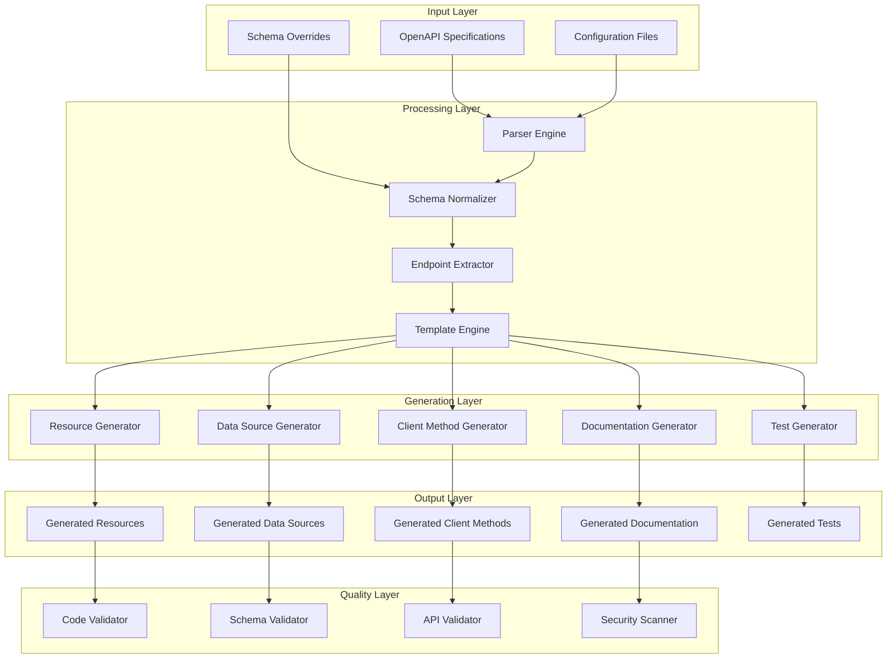
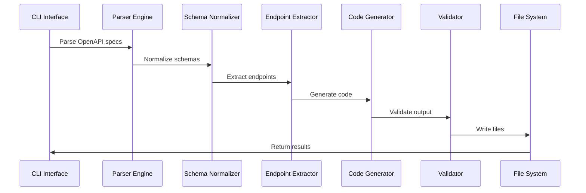
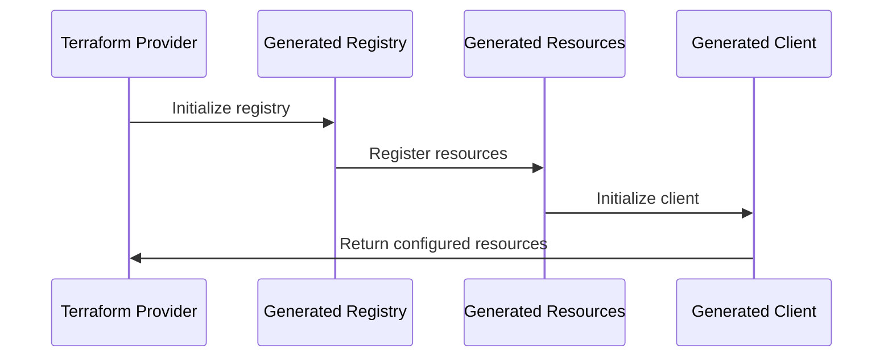

# Terraform Provider Umbrella - Technical Reference

## Table of Contents

1. [System Architecture](#system-architecture)
2. [Component Interactions](#component-interactions)
3. [API Specifications](#api-specifications)
4. [Data Models](#data-models)
5. [Template System](#template-system)
6. [CI/CD Integration](#cicd-integration)
7. [Performance Optimization](#performance-optimization)
8. [Quality Assurance Framework](#quality-assurance-framework)
9. [Extension Points](#extension-points)
10. [Monitoring and Observability](#monitoring-and-observability)

## System Architecture

### High-Level Architecture

The terraform-provider-umbrella follows a layered architecture with clear separation of concerns:



### Core Components

#### 1. Parser Engine (`tools/generator/parser/`)

**OpenAPI Parser** ([`openapi_parser.go`](tools/generator/parser/openapi_parser.go:1))
```go
type OpenAPIParser struct {
    validator *Validator
    logger    *Logger
}

func (p *OpenAPIParser) ParseFile(path string) (*APISpec, error) {
    // Validates and parses OpenAPI 3.0+ specifications
    // Returns structured APISpec for code generation
}
```

**Schema Normalizer** ([`schema_normalizer.go`](tools/generator/parser/schema_normalizer.go:1))
```go
type SchemaNormalizer struct {
    typeMapper    *TypeMapper
    fieldMapper   *FieldMapper
    overrides     *SchemaOverrides
}

func (n *SchemaNormalizer) NormalizeSchema(schema *Schema) (*NormalizedSchema, error) {
    // Converts OpenAPI schemas to Terraform-compatible types
    // Applies custom transformations and overrides
}
```

**Endpoint Extractor** ([`endpoint_extractor.go`](tools/generator/parser/endpoint_extractor.go:1))
```go
type EndpointExtractor struct {
    classifier *ResourceClassifier
    namer      *ResourceNamer
}

func (e *EndpointExtractor) ExtractEndpoints(spec *APISpec) ([]Endpoint, error) {
    // Identifies CRUD operations and resource patterns
    // Classifies endpoints as resources or data sources
}
```

#### 2. Generation Engine (`tools/generator/generator/`)

**Template Engine** ([`template_engine.go`](tools/generator/generator/template_engine.go:1))
```go
type TemplateEngine struct {
    templates map[string]*template.Template
    funcMap   template.FuncMap
    cache     *TemplateCache
}

func (e *TemplateEngine) RenderTemplate(name string, data interface{}) ([]byte, error) {
    // Renders Go templates with advanced features
    // Supports custom functions and caching
}
```

**Resource Generator** ([`resource_generator.go`](tools/generator/generator/resource_generator.go:1))
```go
type ResourceGenerator struct {
    engine     *TemplateEngine
    schema     *AdvancedSchemaGenerator
    validator  *CodeValidator
}

func (g *ResourceGenerator) GenerateResource(endpoint *Endpoint) (*GeneratedFile, error) {
    // Generates complete Terraform resource implementations
    // Includes CRUD operations, validation, and state management
}
```

#### 3. Configuration System (`tools/generator/config/`)

**Basic Configuration** ([`config.go`](tools/generator/config/config.go:1))
```go
type Config struct {
    Global      GlobalConfig      `yaml:"global"`
    Resources   ResourcesConfig   `yaml:"resources"`
    DataSources DataSourcesConfig `yaml:"data_sources"`
    Templates   TemplatesConfig   `yaml:"templates"`
    Parsing     ParsingConfig     `yaml:"parsing"`
    OAuth2      OAuth2Config      `yaml:"oauth2"`
    Output      OutputConfig      `yaml:"output"`
}
```

**Advanced Configuration** ([`advanced_config.yaml`](tools/generator/config/advanced_config.yaml:1))
```yaml
schema_overrides:
  global:
    type_mappings:
      "string_with_format_date": "string"
      "integer_with_format_int64": "int64"
    
    field_mappings:
      "id": "ID"
      "url": "URL"
```

## Component Interactions

### Code Generation Flow



### Resource Registration Flow



## API Specifications

### Supported OpenAPI Features

#### Schema Types
- **Primitive Types**: `string`, `integer`, `number`, `boolean`
- **Complex Types**: `object`, `array`
- **Format Specifiers**: `date`, `date-time`, `email`, `uri`, `uuid`
- **Validation**: `minimum`, `maximum`, `minLength`, `maxLength`, `pattern`, `enum`

#### Advanced Features
- **References**: `$ref` resolution across files
- **Composition**: `allOf`, `oneOf`, `anyOf`
- **Polymorphism**: Discriminator support
- **Inheritance**: Schema inheritance patterns

### API Endpoint Mapping

#### CRUD Operation Detection
```go
type CRUDMapping struct {
    Create: []string{"POST"}
    Read:   []string{"GET"}
    Update: []string{"PUT", "PATCH"}
    Delete: []string{"DELETE"}
    List:   []string{"GET"} // with collection path
}
```

#### Resource Classification
```go
type ResourceClassification struct {
    IsResource   bool   // Has write operations
    IsDataSource bool   // Read-only operations
    ResourceName string // Derived resource name
    CRUDType     string // Primary operation type
}
```

### OAuth2 Scope Resolution

```go
type ScopeResolver struct {
    mappings map[string][]string
}

func (r *ScopeResolver) ResolveScopeForEndpoint(method, path string) []string {
    switch method {
    case "GET":
        return []string{"read"}
    case "POST":
        return []string{"write"}
    case "PUT", "PATCH":
        return []string{"write"}
    case "DELETE":
        return []string{"delete"}
    default:
        return []string{"read"}
    }
}
```

## Data Models

### Core Data Structures

#### APISpec Model ([`models.go`](tools/generator/parser/models.go:1))
```go
type APISpec struct {
    Info       APIInfo               `json:"info"`
    Servers    []Server              `json:"servers"`
    Paths      map[string]PathItem   `json:"paths"`
    Components Components            `json:"components"`
    Security   []SecurityRequirement `json:"security"`
}

type Operation struct {
    OperationID string                `json:"operationId"`
    Summary     string                `json:"summary"`
    Description string                `json:"description"`
    Tags        []string              `json:"tags"`
    Parameters  []Parameter           `json:"parameters"`
    RequestBody *RequestBody          `json:"requestBody"`
    Responses   map[string]Response   `json:"responses"`
    Security    []SecurityRequirement `json:"security"`
}
```

#### Schema Model
```go
type Schema struct {
    Type                 string             `json:"type"`
    Format               string             `json:"format"`
    Description          string             `json:"description"`
    Properties           map[string]*Schema `json:"properties"`
    Items                *Schema            `json:"items"`
    Required             []string           `json:"required"`
    Enum                 []interface{}      `json:"enum"`
    Default              interface{}        `json:"default"`
    Example              interface{}        `json:"example"`
    Ref                  string             `json:"$ref"`
    AllOf                []*Schema          `json:"allOf"`
    OneOf                []*Schema          `json:"oneOf"`
    AnyOf                []*Schema          `json:"anyOf"`
    AdditionalProperties interface{}        `json:"additionalProperties"`
}
```

### Generated Code Models

#### Resource Structure
```go
type GeneratedResource struct {
    Name        string
    Schema      map[string]schema.Attribute
    Methods     ResourceMethods
    Validation  []validator.String
    Modifiers   []planmodifier.String
}

type ResourceMethods struct {
    Create func(context.Context, resource.CreateRequest, *resource.CreateResponse)
    Read   func(context.Context, resource.ReadRequest, *resource.ReadResponse)
    Update func(context.Context, resource.UpdateRequest, *resource.UpdateResponse)
    Delete func(context.Context, resource.DeleteRequest, *resource.DeleteResponse)
}
```

#### Client Structure
```go
type GeneratedClient struct {
    *apiClient
    cache map[string]cacheEntry
}

type cacheEntry struct {
    data      interface{}
    timestamp time.Time
    ttl       time.Duration
}
```

## Template System

### Template Architecture

The template system uses Go's `text/template` package with custom functions and advanced features.

#### Template Structure
```
tools/generator/templates/
├── resource.go.tmpl          # Terraform resource template
├── data_source.go.tmpl       # Terraform data source template
├── client_method.go.tmpl     # API client method template
├── test.go.tmpl             # Test file template
└── docs.md.tmpl             # Documentation template
```

#### Resource Template ([`resource.go.tmpl`](tools/generator/templates/resource.go.tmpl:1))
```go
package provider

import (
    "context"
    "fmt"
    
    "github.com/hashicorp/terraform-plugin-framework/resource"
    "github.com/hashicorp/terraform-plugin-framework/resource/schema"
    "github.com/hashicorp/terraform-plugin-framework/types"
)

// {{.ResourceName}}Resource implements the resource interface
type {{.ResourceName}}Resource struct {
    client *GeneratedClient
}

func New{{.ResourceName}}Resource() resource.Resource {
    return &{{.ResourceName}}Resource{}
}

func (r *{{.ResourceName}}Resource) Metadata(_ context.Context, req resource.MetadataRequest, resp *resource.MetadataResponse) {
    resp.TypeName = req.ProviderTypeName + "_{{.ResourceNameSnake}}"
}

func (r *{{.ResourceName}}Resource) Schema(_ context.Context, _ resource.SchemaRequest, resp *resource.SchemaResponse) {
    resp.Schema = schema.Schema{
        Description: "{{.Description}}",
        Attributes: map[string]schema.Attribute{
            {{range .Attributes}}
            "{{.Name}}": {{.SchemaDefinition}},
            {{end}}
        },
    }
}
```

#### Custom Template Functions
```go
var templateFuncs = template.FuncMap{
    "toCamelCase":     toCamelCase,
    "toSnakeCase":     toSnakeCase,
    "toPascalCase":    toPascalCase,
    "toTerraformType": toTerraformType,
    "toGoType":        toGoType,
    "isRequired":      isRequired,
    "hasValidation":   hasValidation,
    "formatComment":   formatComment,
}
```

### Template Customization

#### Custom Templates
Users can provide custom templates for specific needs:

```yaml
# tools/generator/config/generation.yaml
templates:
  resource_template: "templates/custom_resource.go.tmpl"
  data_source_template: "templates/custom_data_source.go.tmpl"
  client_method_template: "templates/custom_client_method.go.tmpl"
```

#### Template Variables
```go
type TemplateData struct {
    ResourceName      string
    ResourceNameSnake string
    Description       string
    Attributes        []AttributeData
    Methods           []MethodData
    Imports           []string
    PackageName       string
    ClientName        string
}
```

## CI/CD Integration

### GitHub Actions Workflows

#### Code Generation Workflow
```yaml
# .github/workflows/code-generation.yml
name: Code Generation
on:
  push:
    paths:
      - '*.yaml'
      - '*.yml'
      - 'tools/generator/**'

jobs:
  generate:
    runs-on: ubuntu-latest
    steps:
      - uses: actions/checkout@v4
      - uses: actions/setup-go@v4
        with:
          go-version: '1.21'
      
      - name: Generate Code
        run: |
          make generate-full
          
      - name: Validate Generated Code
        run: |
          go build ./...
          go vet ./...
          go test ./...
          
      - name: Create Pull Request
        if: github.ref == 'refs/heads/main'
        uses: peter-evans/create-pull-request@v5
        with:
          title: 'Auto-generated code updates'
          body: 'Automated code generation from OpenAPI specifications'
          branch: 'auto-generated-updates'
```

#### Validation Workflow
```yaml
# .github/workflows/validate-generated.yml
name: Validate Generated Code
on:
  pull_request:
    paths:
      - 'internal/provider/generated_*.go'

jobs:
  validate:
    runs-on: ubuntu-latest
    steps:
      - uses: actions/checkout@v4
      - uses: actions/setup-go@v4
        with:
          go-version: '1.21'
          
      - name: Code Quality Checks
        run: |
          go fmt ./...
          go vet ./...
          golangci-lint run
          
      - name: Security Scan
        run: |
          gosec ./...
          
      - name: Test Coverage
        run: |
          go test -coverprofile=coverage.out ./...
          go tool cover -func=coverage.out
```

### Build Integration

#### Makefile Targets
```makefile
# Generate all Phase 2 features
.PHONY: generate-full
generate-full:
	@echo "Generating Phase 2 provider code with advanced features..."
	go run tools/generator/cmd/generate/main.go
	@echo "Formatting generated code..."
	go fmt ./internal/provider/generated_*.go
	@echo "Validating generated code..."
	go vet ./internal/provider/generated_*.go
	@echo "Generation complete!"

# Generate with validation
.PHONY: generate-validate
generate-validate: generate-full
	go build ./...
	go test ./...
	golangci-lint run ./internal/provider/generated_*.go
```

## Performance Optimization

### Parallel Processing

#### Worker Pool Implementation
```go
type WorkerPool struct {
    workers    int
    jobs       chan Job
    results    chan Result
    wg         sync.WaitGroup
}

func (p *WorkerPool) Process(jobs []Job) []Result {
    // Distribute jobs across workers
    // Collect results efficiently
    // Handle errors gracefully
}
```

#### Configuration
```yaml
# tools/generator/config/advanced_config.yaml
performance:
  parallel_processing:
    enabled: true
    max_workers: 4
    batch_size: 10
```

### Caching System

#### Template Caching
```go
type TemplateCache struct {
    cache map[string]*template.Template
    mutex sync.RWMutex
    ttl   time.Duration
}

func (c *TemplateCache) Get(key string) (*template.Template, bool) {
    c.mutex.RLock()
    defer c.mutex.RUnlock()
    
    tmpl, exists := c.cache[key]
    return tmpl, exists
}
```

#### Response Caching ([`generated_client.go`](internal/provider/generated_client.go:1))
```go
func (c *GeneratedClient) doWithCache(ctx context.Context, method, path string, body []byte, cacheTTL time.Duration) (*http.Response, error) {
    // For GET requests, check cache first
    if method == "GET" && cacheTTL > 0 {
        cacheKey := fmt.Sprintf("%s:%s", method, path)
        if cached, found := c.getCachedResponse(cacheKey); found {
            return c.createCachedResponse(cached)
        }
    }
    
    // Perform actual request and cache response
    resp, err := c.do(ctx, method, path, body)
    if err != nil {
        return nil, err
    }
    
    // Cache successful GET responses
    if method == "GET" && cacheTTL > 0 && resp.StatusCode == http.StatusOK {
        // Cache implementation
    }
    
    return resp, nil
}
```

### Memory Optimization

#### Streaming Processing
```go
type StreamingParser struct {
    reader io.Reader
    buffer []byte
    offset int
}

func (p *StreamingParser) ParseLarge(reader io.Reader) error {
    // Process large files without loading entirely into memory
    // Use streaming JSON decoder
    // Implement backpressure handling
}
```

## Quality Assurance Framework

### Validation Layers

#### 1. Syntax Validation
```go
type CodeValidator struct {
    formatter *Formatter
    linter    *Linter
}

func (v *CodeValidator) ValidateCode(code []byte) []ValidationError {
    // Check Go syntax
    // Verify imports
    // Validate function signatures
    // Check for common errors
}
```

#### 2. Schema Validation
```go
type SchemaValidator struct {
    tfValidator *TerraformValidator
    apiValidator *APIValidator
}

func (v *SchemaValidator) ValidateSchema(schema *Schema) []ValidationError {
    // Terraform compliance checks
    // Type consistency validation
    // Required field verification
    // Constraint validation
}
```

#### 3. Security Validation
```go
type SecurityValidator struct {
    rules []SecurityRule
}

type SecurityRule struct {
    Name     string
    Pattern  *regexp.Regexp
    Message  string
    Severity Severity
}

func (v *SecurityValidator) Scan(code []byte) []SecurityIssue {
    // Detect hardcoded secrets
    // Check for insecure patterns
    // Validate authentication handling
    // Identify potential vulnerabilities
}
```

### Test Generation

#### Test Types
```go
type TestGenerator struct {
    unitTester       *UnitTestGenerator
    integrationTester *IntegrationTestGenerator
    acceptanceTester  *AcceptanceTestGenerator
}

// Unit tests for schema validation
func (g *UnitTestGenerator) GenerateUnitTests(resource *Resource) []TestCase

// Integration tests for API interaction
func (g *IntegrationTestGenerator) GenerateIntegrationTests(resource *Resource) []TestCase

// Acceptance tests for full Terraform lifecycle
func (g *AcceptanceTestGenerator) GenerateAcceptanceTests(resource *Resource) []TestCase
```

## Extension Points

### Custom Generators

#### Interface Definition
```go
type CustomGenerator interface {
    Name() string
    Generate(spec *APISpec, config *Config) (*GeneratedFile, error)
    Validate(file *GeneratedFile) []ValidationError
}
```

#### Implementation Example
```go
type MetricsGenerator struct {
    config *MetricsConfig
}

func (g *MetricsGenerator) Generate(spec *APISpec, config *Config) (*GeneratedFile, error) {
    // Generate metrics collection code
    // Add performance monitoring
    // Create observability hooks
}
```

### Custom Validators

#### Validator Interface
```go
type CustomValidator interface {
    Name() string
    Validate(data interface{}) []ValidationError
    Configure(config map[string]interface{}) error
}
```

#### Implementation Example
```go
type BusinessRuleValidator struct {
    rules []BusinessRule
}

func (v *BusinessRuleValidator) Validate(resource *Resource) []ValidationError {
    // Apply business-specific validation rules
    // Check compliance requirements
    // Validate organizational policies
}
```

### Plugin System

#### Plugin Architecture
```go
type Plugin interface {
    Name() string
    Version() string
    Initialize(config *PluginConfig) error
    Execute(context *ExecutionContext) error
    Cleanup() error
}

type PluginManager struct {
    plugins map[string]Plugin
    loader  *PluginLoader
}
```

## Monitoring and Observability

### Metrics Collection

#### Performance Metrics
```go
type Metrics struct {
    GenerationTime    time.Duration
    FilesGenerated    int
    LinesOfCode       int
    CacheHitRate      float64
    ErrorRate         float64
    ValidationErrors  int
}

func (m *Metrics) Record(event string, duration time.Duration) {
    // Record performance metrics
    // Track generation statistics
    // Monitor error rates
}
```

#### Health Checks
```go
type HealthChecker struct {
    checks []HealthCheck
}

type HealthCheck struct {
    Name     string
    Check    func() error
    Timeout  time.Duration
    Critical bool
}

func (h *HealthChecker) RunChecks() HealthStatus {
    // Verify system components
    // Check external dependencies
    // Validate configuration
    // Report overall health
}
```

### Logging Framework

#### Structured Logging
```go
type Logger struct {
    level  LogLevel
    output io.Writer
    fields map[string]interface{}
}

func (l *Logger) WithOperation(op string) *Logger {
    return l.WithField("operation", op)
}

func (l *Logger) WithFile(file string) *Logger {
    return l.WithField("file", file)
}

func (l *Logger) Info(msg string) {
    l.log(INFO, msg)
}
```

### Error Tracking

#### Error Classification
```go
type ErrorClassifier struct {
    patterns map[string]ErrorType
}

type ErrorType int

const (
    SyntaxError ErrorType = iota
    ValidationError
    APIError
    ConfigurationError
    SystemError
)

func (c *ErrorClassifier) Classify(err error) ErrorType {
    // Analyze error patterns
    // Categorize error types
    // Provide remediation suggestions
}
```

This technical reference provides comprehensive documentation of the terraform-provider-umbrella's architecture, components, and implementation details, serving as a definitive guide for developers, operators, and contributors working with the system.